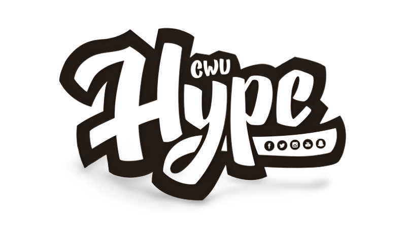
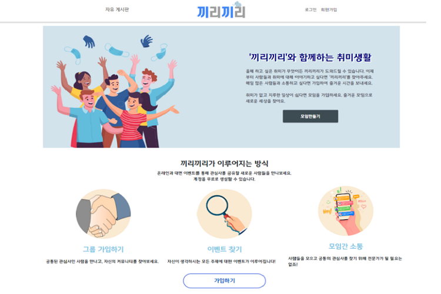
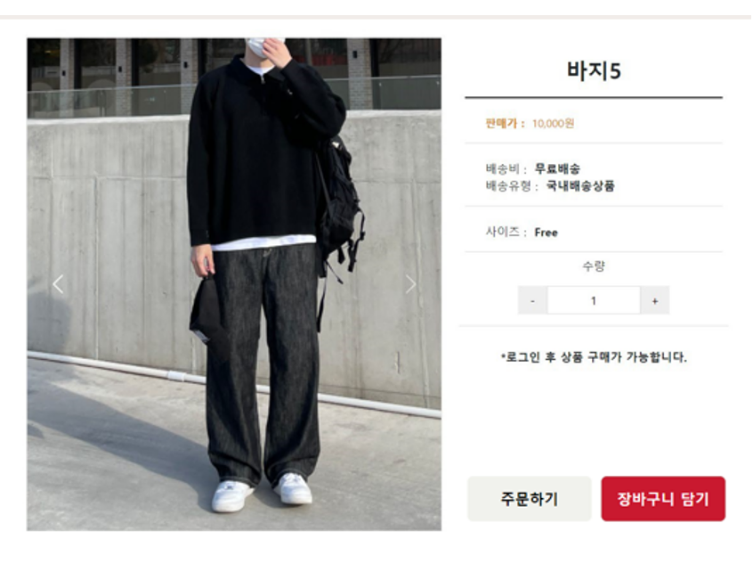
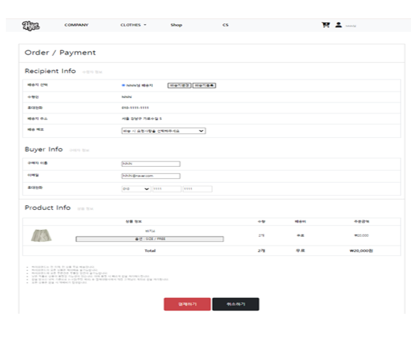
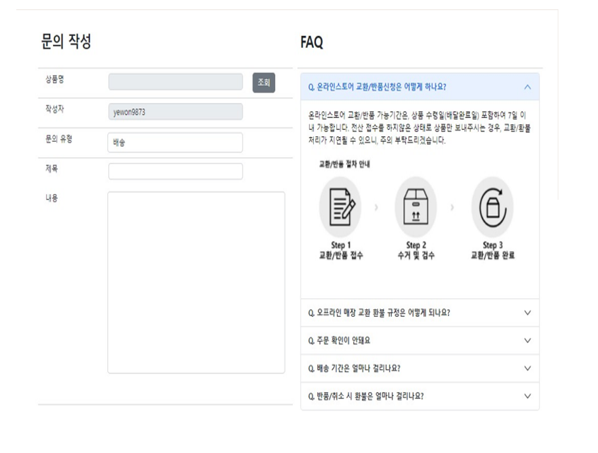
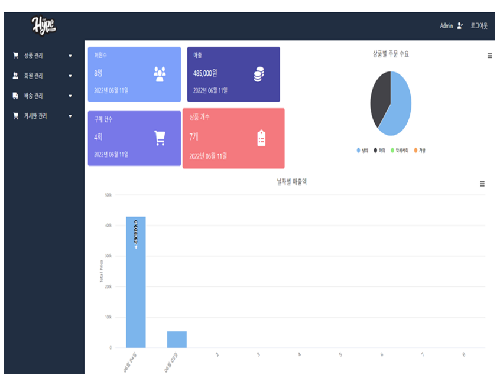

# 쇼핑몰 프로젝트

## 📖 프로젝트 개요
- 의류, 가방, 악세사리등 다양한 상품을 판매하는 쇼핑몰

---------------------------------------

## 📆 구현 기간

- 프로젝트 기획 기간 : 22.05.16 ~ 22.05.20
- 프로젝트 구현 기간 : 22.05.27 ~ 22.06.12
---------------------------------------
## 🔨 개발 환경 및 사용 도구
|구분|항목|
|:---:|:---:|
|OS|Window10|
|IDE|Eclipse, VS Code, SQL Developer|
|Server / DBMS|Apache Tomcat 8.5 / Oracle 11g XE|
|Framework / Platform|Bootstrap|
|Pattern|MVC MODEL2 Pattern|
|Development Languages|Java, HTML, CSS , Javascript, Jquery, Servlet, JSP, Ajax, Oracle SQL|
|Library|ojdbc8, cos.jar, gson2.8.9, dbcp2, highcharts|

---------------------------------------

## 🔎 핵심 구현 기술

1️⃣ 사용자 페이지

|구분|내용|
|---|---|
|메인|이미지 캐러셀 이용,카테고리 드롭다운|
|회사 소개 및 위치|회사 정보와 위치(지점별) 소개(카카오맵 API)|
|로그인|로그인(카카오API 가능), 회원가입,로그아웃|
|마이페이지|개인 정보 수정, 사용자가 주문한 주문 목록 확인, 배송 상태 확인|
|게시판|Q&A 게시판을 통해 관리자와 소통|
|상품보기|상품 랭킹 노출(판매순), 카테고리별 필터링|
|상품 상세 보기|상품 사진 클릭시, 상품 상세 페이지로 이동 후 장바구니, 구매(아임포트 결제 API ), 리뷰 등록|

2️⃣ 관리자 페이지

|구분|내용|
|---|---|
|메인|그래프를 통해 카테고리별 랭킹 및 일 매출 조회 가능(Highcharts), 회원수, 총 매출 등 조회 |
|로그인|로그아웃을 하면 사용자 페이지로 다시 이동|
|회원 관리|회원 조회 및 회원 정보 수정|
|상품 관리|상품 등록 조회 및 상품 수정(이미지 업로드)|
|배송 관리|사용자가 구매한 배송 정보 조회 및 변경(다음 API 주소, 배송 상태 변경) |
|게시판 관리|사용자가 남긴 Q&A 및 리뷰 관리(모달 이용)|

---------------------------------------

## 😙나의 역할 및 담당 기능

#### 직책 : 팀원

#### 담당 기능 : 관리자 페이지 UI 구현 및 메인, 게시판 관리, 배송 관리(UI 및 기능 구현) -> *[구현 ppt](https://github.com/kimyeong96/Semi_project/blob/main/ppt/admin_ppt.pptx)*

> code
* jsp
  * [메인](https://github.com/kimyeong96/Semi_project/blob/main/semi_project/admin/adminMain/adminMain.jsp)
  * [게시판](https://github.com/kimyeong96/Semi_project/tree/main/semi_project/admin/board)
  * [배송](https://github.com/kimyeong96/Semi_project/tree/main/semi_project/admin/delivery)

* DAO
  * [메인](https://github.com/kimyeong96/Semi_project/blob/main/semi_project/src/main/java/com/hype/dao/AdminMainDAO.java)
  * [게시판 관리 - Q&A](https://github.com/kimyeong96/Semi_project/blob/main/semi_project/src/main/java/com/hype/dao/AdminBoardQnaDAO.java)
  * [게시판 관리 -리뷰](https://github.com/kimyeong96/Semi_project/blob/main/semi_project/src/main/java/com/hype/dao/AdminBoardReviewDAO.java)
  * [배송](https://github.com/kimyeong96/Semi_project/blob/main/semi_project/src/main/java/com/hype/dao/AdminShipmentDAO.java)

* Controller
  * [메인](https://github.com/kimyeong96/Semi_project/blob/main/semi_project/src/main/java/com/hype/controller/AdminMainController.java)
  * [게시판 관리 - Q&A](https://github.com/kimyeong96/Semi_project/blob/main/semi_project/src/main/java/com/hype/controller/AdminBoardQnaController.java)
  * [게시판 관리 -리뷰](https://github.com/kimyeong96/Semi_project/blob/main/semi_project/src/main/java/com/hype/controller/AdminBoardReviewController.java)
  * [배송](https://github.com/kimyeong96/Semi_project/blob/main/semi_project/src/main/java/com/hype/controller/AdminShipmentController.java)

---------------------------------------

## 📸 완성 화면 및 기능 보기

---------------------------------------

## 😃 느낀점
- DB 설계의 중요성을 느꼈다. DB 설계에 충분한 시간을 갖지 못했다.  DB가 확립되지 않아,  기능에 따른 데이터베이스의 수정이 불가피해졌다. 그로 인해서 기능 구현에 차질이 있었고, 많은 불필요한 시간을 써야만 했다. DB뿐만 아니라 전반적인 프로젝트의 계획을 확실하게 잡고 가는 것이 중요하다.

- 팀원 간의 의사소통이 중요했다. 비대면 속에서 진행되었던 프로젝트에서 팀원 간의 의사소통이 많이 힘들었다. 서로가 의미하는 바를 정확하게 전달할 수 없었던 때가 있었고, 서로 간의 피드백과 도움을 주는 것 또한 많은 제약이 있었다.

- 사용자의 입장과 관리자의 입장에서 바라보면서 프로젝트를 설계하기가 쉽지 않았다. 평소 쉽고 간단하게 생각했었던 기능들 또한, 구현을 하면서 어려움을 겪었다. 많은 시행착오를 거쳐야 좋은 웹페이지가 만들어진다는 것을 느꼈다. 많은 공부와 오류를 찾아 해결하는 능력도 길러야 한다고 생각이 들었다.

- 세미 프로젝트를 통해 팀원들과 같이 개발하면서, 혼자 생각하지 못했던 기능 구현의 방식과, 아이디어 등을 얻을 수 있었다.

---------------------------------------

## 😥 아쉬운 점
- 상대적으로 짧게 느껴졌던 프로젝트 기간이었기에 , UI 구현에 시간을 많이 쓰지 못했던 부분이 있었다. 반응형 웹 페이지를 목적으로 하였지만, 몇몇 페이지는 반응형 작동이 안 되는 부분들도 있었고, 계획했던 대로 UI 구현을 하지 못했던 부분들도 있었기 때문에 많은 아쉬운 점으로 남아있다. 다음에는 이러한 점을 보완하여 좀 더 완벽한 웹페이지를 만들어보고 싶다.

---------------------------------------
## 📑 기타 문서
* [전체 PPT](https://github.com/kimyeong96/Semi_project/blob/main/ppt/HypeLand.pptx)
* [구현 화면 PPT](https://github.com/kimyeong96/Semi_project/blob/main/ppt/%EA%B8%B0%EB%8A%A5%20%EA%B5%AC%ED%98%84%20ppt.pptx)
* [DB](https://github.com/kimyeong96/Semi_project/blob/main/screenshoots/db.png)
